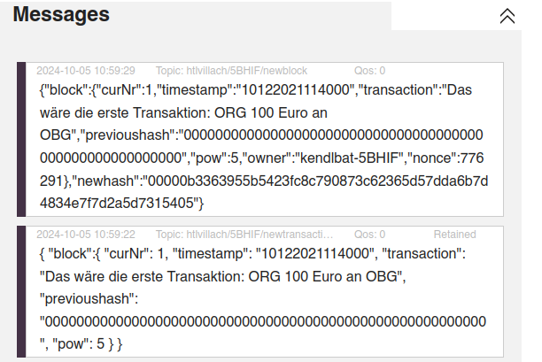
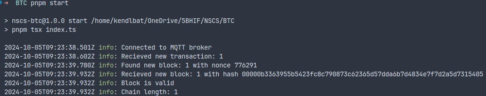

# 5BHIF NSCS - Blockchain bauen

Tobias Kendlbacher
2024-10-05

## How to run

### Docker

Note: This was only tested with podman, but usually works with docker as well.

```sh
docker compose build
docker compose up
```

### Podman

```
podman compose build
podman compose --podman-run-args="--replace" up
```

### Local

Dependencies:

-   `pnpm` (Tested with version `9.12.0`)
-   `node` (v22, tested with version `22.8.0`)

Running:

```sh
pnpm i
pnpm run start
```

## Screenshots

### Messages on broker



### Console


